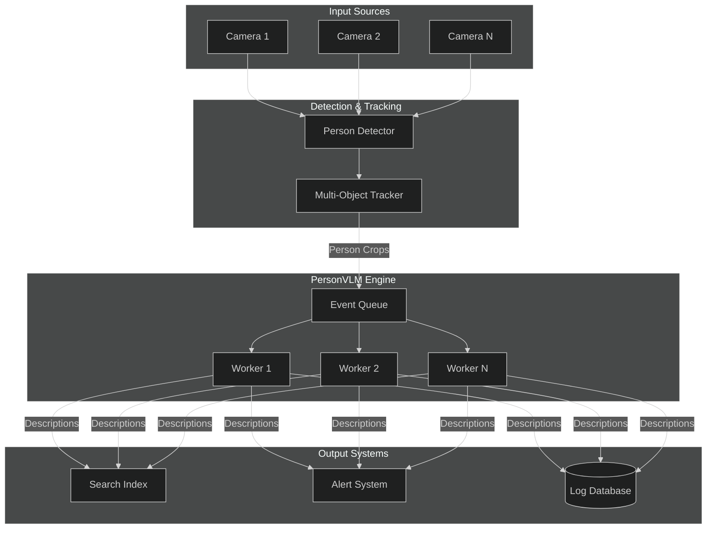
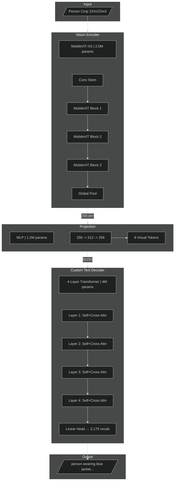
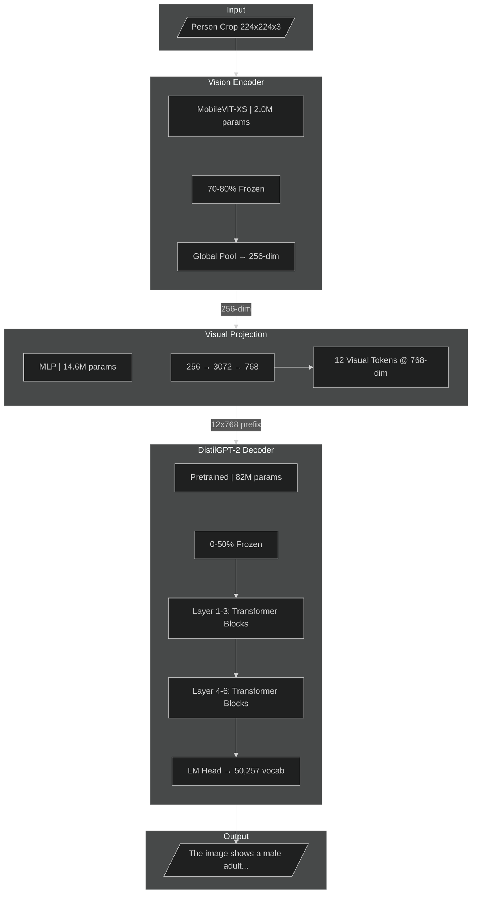
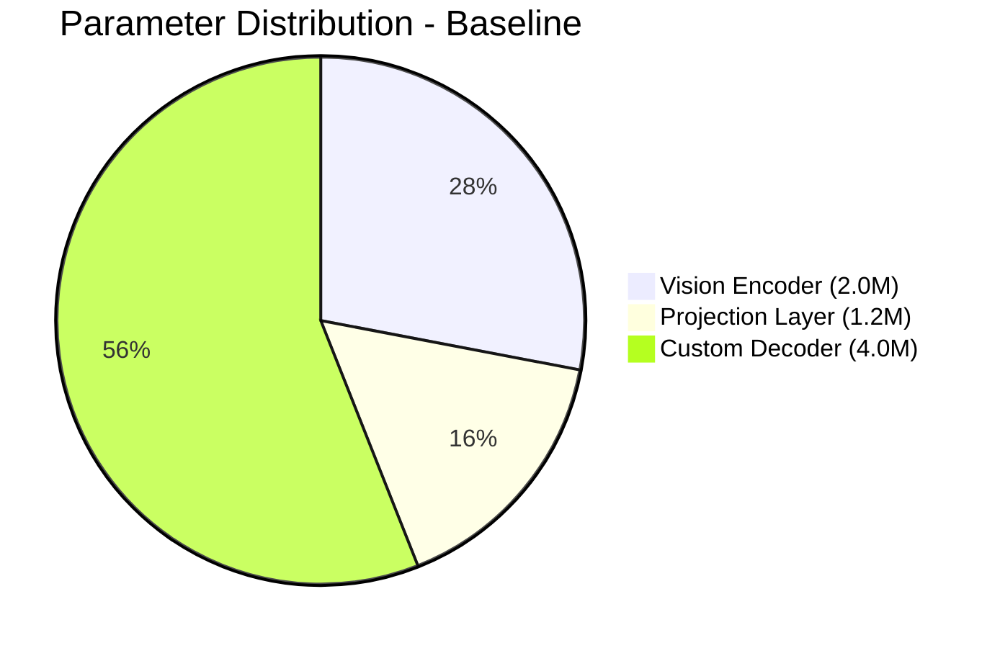
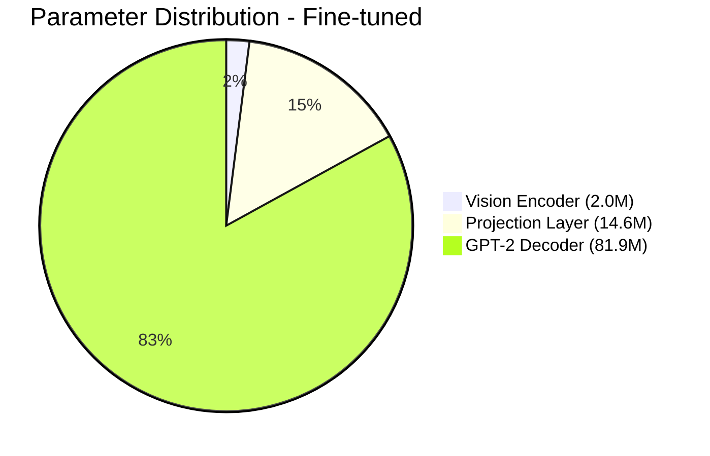
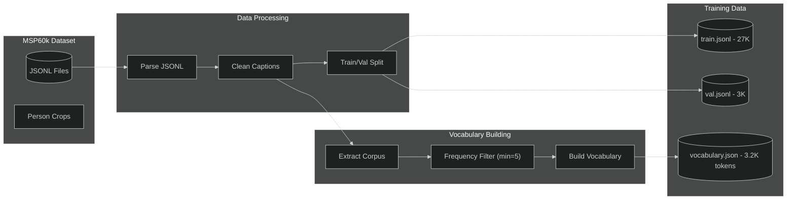
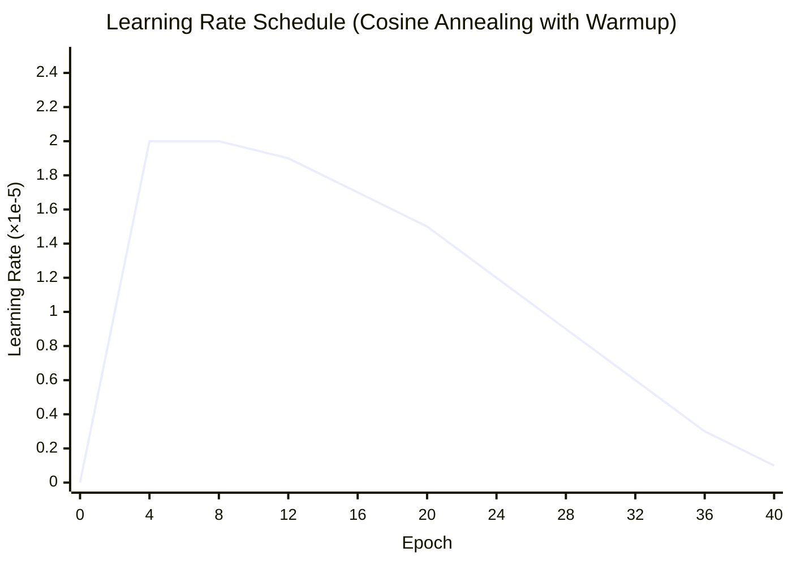
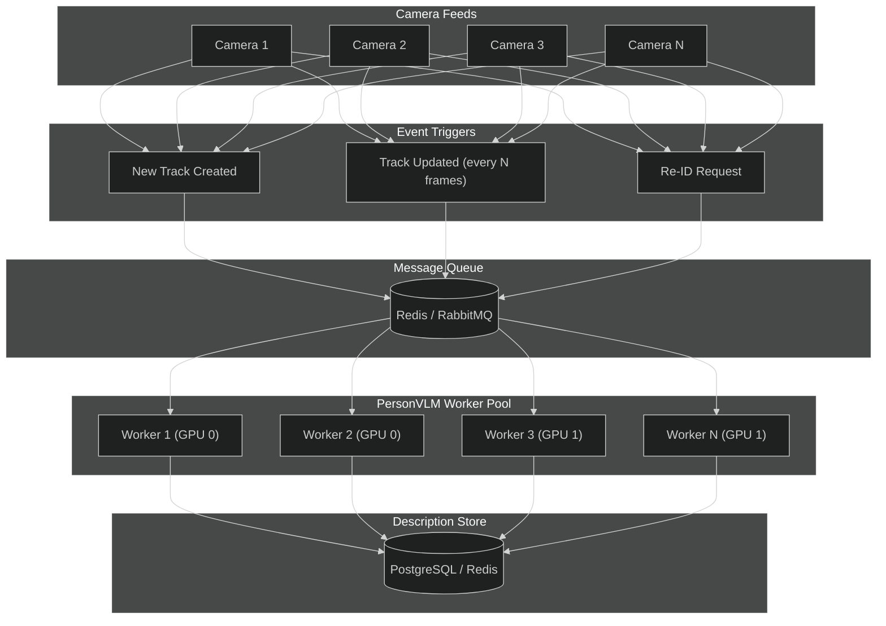
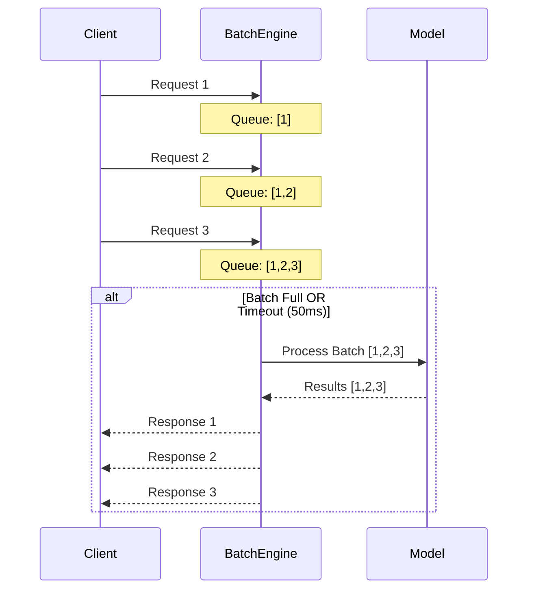
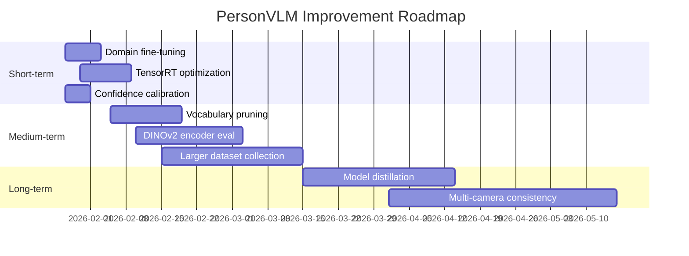

# PersonVLM: Lightweight Vision-Language Model for Real-Time Person Description

## Executive Summary

**PersonVLM** is a lightweight vision-language model designed to generate structured natural language descriptions of people from cropped images in real-time video analytics systems.

### Complete Model Progression

We developed PersonVLM through a systematic 4-stage progression, demonstrating the impact of scaling, pretrained backbones, and fine-tuning:

| Metric | Stage 1: Baseline | Stage 2: Scaled | Stage 3: Pretrained | Stage 4: Fine-tuned |
|--------|-------------------|-----------------|---------------------|---------------------|
| **Parameters** | 7.26M | 33.84M | 93.78M | **98.51M** |
| **Budget Used** | 7.3% | 33.8% | 93.8% | **98.5%** |
| **Validation Loss** | 2.80 | 2.63 | 2.40 | **2.26** |
| **BLEU-4** | 24.19% | 23.16% | 24.36% | **24.86%** |
| **CIDEr** | 0.75 | 0.73 | 0.79 | **0.83** |
| **ROUGE-L** | 42.98% | 41.34% | 41.68% | **42.22%** |
| **Decoder Type** | Custom (4-layer) | Custom (6-layer) | DistilGPT-2 (frozen) | DistilGPT-2 (unfrozen) |
| **Training Time** | ~2.8 hours (M4) | ~11 min (V100) | ~9 min (V100) | ~40 min (V100) |

**Key Findings:**
- **Stage 1→2**: Simply scaling parameters provides minimal improvement
- **Stage 2→3**: Leveraging pretrained language models significantly reduces loss
- **Stage 3→4**: Full fine-tuning achieves the best results across all metrics

**Recommended Model: Stage 4 (Fine-tuned, 98.51M)** — Best performance while staying within 100M budget.

Key differentiator: Unlike large VLMs (7B+ parameters), PersonVLM achieves practical deployment constraints without sacrificing output quality for the narrow task of person description.

### Screenshots

#### Demo Website - Hero Section


#### Inference Results Comparison


#### Training Metrics Dashboard


#### Terminal Output - Sample Inference Results
<details>
<summary>Click to expand terminal screenshots</summary>


</details>

---

## Table of Contents

1. [Problem Statement](#problem-statement)
2. [Design Constraints](#design-constraints)
3. [Solution Approach](#solution-approach)
4. [System Architecture](#system-architecture)
5. [Data Pipeline](#data-pipeline)
6. [Model Design](#model-design)
7. [Experimental Progression](#experimental-progression)
   - [Stage 1: Baseline Model](#stage-1-baseline-model-726m-parameters)
   - [Stage 2: Scaled Model](#stage-2-scaled-model-3384m-parameters)
   - [Stage 3: Pretrained Decoder](#stage-3-pretrained-decoder-9378m-parameters)
   - [Stage 4: Fine-tuned Model](#stage-4-fine-tuned-model-9851m-parameters)
8. [Results Analysis](#results-analysis)
9. [Inference Architecture](#inference-architecture)
10. [Trade-offs and Limitations](#trade-offs-and-limitations)
11. [Future Improvements](#future-improvements)
12. [Getting Started](#getting-started)
13. [Benchmarks](#benchmarks)

---

## Problem Statement

### Context

Modern video analytics systems process feeds from hundreds to thousands of cameras simultaneously. A common requirement is generating human-readable descriptions of detected persons for:

- **Cross-camera re-identification**: Matching persons across non-overlapping camera views
- **Natural language search**: "Find the person wearing a red jacket carrying a backpack"
- **Alert generation**: Automated incident descriptions for security operators
- **Forensic analysis**: Structured metadata for post-event investigation

### The Challenge

Existing approaches fall into two extremes:

| Approach | Limitation |
|----------|------------|
| **Large VLMs (e.g., LLaVA, Gemini, GPT-4V)** | 7B-70B parameters; impractical for real-time, multi-camera deployment |
| **Attribute classifiers** | Fixed taxonomy; cannot handle novel combinations or natural language output |

### Our Goal

Build a **specialized, lightweight VLM** that:
- Generates structured natural language descriptions from cropped person images
- Operates within strict resource constraints (≤100M parameters)
- Scales to hundreds of concurrent camera streams
- Produces consistent, parseable output for downstream systems

**Example Output:**
```
Input:  [Person crop from tracking system]
Output: "The image shows a male adult with black hair wearing a dark blue jacket 
         and gray pants. He is carrying a laptop bag and appears to be walking."
```

---

## Design Constraints

The following constraints shaped every architectural decision:

| Constraint | Requirement | Rationale |
|------------|-------------|-----------|
| **Parameter Budget** | ≤100M total parameters | Enables deployment on consumer/edge GPUs and reduces inference cost |
| **Inference Latency** | <50ms per image | Supports real-time processing at 20+ FPS |
| **Memory Footprint** | <4GB GPU memory | Allows multi-model deployment on single GPU |
| **Output Format** | Structured, controlled vocabulary | Ensures parseability for downstream systems |
| **Training Cost** | Minimal manual annotation | Uses pre-captioned datasets |
| **Scalability** | Event-driven, stateless inference | Horizontal scaling across camera feeds |

*Note: All latency and throughput numbers throughout this document are indicative estimates based on internal benchmarks and may vary depending on hardware configuration and deployment conditions.*

---

## Solution Approach

### Why Not Use Existing Solutions?

| Option | Why Not Suitable |
|--------|------------------|
| **Fine-tune LLaVA-7B** | 7B parameters is 70x our budget; inference latency ~500ms |
| **Distill from large VLMs** | Output distribution too complex for small models to match |
| **Train attribute classifier** | Cannot produce natural language; limited to predefined classes |
| **Use CLIP + template** | CLIP embeddings lack fine-grained clothing/action details |

### Our Approach: Task-Specific Micro-VLM with Pretrained Backbone

We build a **purpose-built VLM** optimized for person description through progressive refinement:

1. **Leverage pretrained vision encoders** - MobileViT-XS pretrained on ImageNet; freeze most layers
2. **Leverage pretrained language models** - DistilGPT-2 as decoder (key innovation in Stages 3-4)
3. **Fine-tune end-to-end** - Unfreeze decoder layers for task-specific adaptation
4. **Use prefix-based visual conditioning** - Project visual features to LM embedding space

This approach achieves the expressiveness of a VLM with the efficiency of a specialized model.

---

## System Architecture

### High-Level System Flow



### Model Architecture Evolution

We developed two distinct architectures across our 4-stage progression:

#### Baseline Architecture (Stages 1-2): Custom Decoder



#### Pretrained Architecture (Stages 3-4): DistilGPT-2 Decoder



### Parameter Budget Comparison

#### Stage 1: Baseline (7.26M Total)


#### Stage 4: Fine-tuned (98.51M Total)


| Component | Stage 1 | Stage 2 | Stage 3 | Stage 4 |
|-----------|---------|---------|---------|---------|
| Vision Encoder | 2.0M | 2.0M | 2.0M | 2.0M |
| Projection Layer | 1.2M | 4.9M | 9.8M | 14.6M |
| Text Decoder | 4.0M | 27.0M | 81.9M | 81.9M |
| **Total** | **7.26M** | **33.84M** | **93.78M** | **98.51M** |
| **Budget Used** | **7.3%** | **33.8%** | **93.8%** | **98.5%** |

---

## Data Pipeline

### Dataset: MSP60k

We use the **MSP60k dataset**, a pre-captioned collection of cropped person images with structured natural language descriptions. This eliminates the need for manual annotation or API-based caption generation.



### Dataset Statistics

| Metric | Value |
|--------|-------|
| **Training samples** | 27,000 |
| **Validation samples** | 3,000 |
| **Total images** | 30,000 |
| **Vocabulary size (custom)** | 3,179 tokens |
| **Vocabulary size (GPT-2)** | 50,257 tokens |
| **Avg caption length** | ~30-50 tokens |
| **Format** | JSONL (image path + caption) |

### Data Format

Each JSONL entry contains:
```json
{
  "image": "path/to/person_crop.jpg",
  "answer": "The image shows a male adult with black hair wearing a red jacket 
             over a long-sleeved shirt and black trousers. He is walking."
}
```

### Vocabulary Construction (Stages 1-2)

For baseline models, vocabulary is built from the training corpus:

```python
# Build vocabulary from corpus
vocabulary = PersonVocabulary.from_corpus(
    captions=training_captions,
    min_freq=5,           # Minimum word frequency
    max_vocab_size=5000   # Upper bound
)
# Result: 3,179 tokens including special tokens (<pad>, <bos>, <eos>, <unk>)
```

For pretrained models (Stages 3-4), we use GPT-2's tokenizer (50,257 tokens).

---

## Model Design

### Vision Encoder Selection

We evaluated multiple lightweight vision backbones:

| Model | Parameters | ImageNet Top-1 | Inference (ms) | Selected |
|-------|------------|----------------|----------------|----------|
| MobileNetV3-Small | 2.5M | 67.4% | 3.2 | No |
| EfficientNet-B0 | 5.3M | 77.1% | 4.8 | No |
| **MobileViT-XS** | **2.3M** | **74.8%** | **4.1** | **Yes** |
| MobileViT-S | 5.6M | 78.4% | 6.2 | Alternative |

**MobileViT-XS** was selected for:
- Optimal accuracy/parameter trade-off
- Attention mechanism captures global context (important for person understanding)
- Well-suited for transfer learning

### Text Decoder Comparison

| Property | Custom Decoder (Stages 1-2) | DistilGPT-2 (Stages 3-4) |
|----------|----------------------------|--------------------------|
| **Architecture** | Transformer with cross-attn | GPT-2 decoder-only |
| **Parameters** | 4-27M | 82M |
| **Layers** | 4-6 | 6 |
| **Hidden Dim** | 256-512 | 768 |
| **Attention Heads** | 4-8 | 12 |
| **Vocabulary** | 3,179 (custom) | 50,257 (BPE) |
| **Pretrained** | No | Yes (WebText) |
| **Language Quality** | Basic | Natural, fluent |
| **Visual Integration** | Cross-attention | Prefix-based |

### Custom Decoder Design (Stages 1-2)

| Design Choice | Decision | Rationale |
|---------------|----------|-----------|
| **Layers** | 4-6 | Sufficient for 30-word outputs |
| **Hidden Dim** | 256-512 | Balances capacity with budget |
| **Attention Heads** | 4-8 | Fine-grained attention patterns |
| **FFN Multiplier** | 4x | Standard transformer ratio |
| **Max Length** | 256 tokens | Accommodates detailed descriptions |
| **Embedding Tying** | Yes | Reduces embedding parameters by 50% |

### Prefix-Based Visual Conditioning (Stages 3-4)

For pretrained decoder models, we use prefix-based conditioning:

```
Input Sequence: [visual_token_1, ..., visual_token_N, text_token_1, text_token_2, ...]
                 └────── Visual Prefix ──────┘  └────── Generated Text ──────────┘
```

Visual features are projected to GPT-2's embedding dimension (768) and prepended as "soft prompts" that condition the language model's generation.

### Controlled Vocabulary Taxonomy (Stages 1-2)

| Category | Example Tokens |
|----------|----------------|
| **Subjects** | `person`, `male`, `female`, `adult`, `child` |
| **Upper Clothing** | `shirt`, `t-shirt`, `jacket`, `coat`, `sweater`, `hoodie`, `blouse`, `vest` |
| **Lower Clothing** | `pants`, `jeans`, `shorts`, `skirt`, `trousers`, `dress`, `sweatpants` |
| **Colors** | `black`, `white`, `red`, `blue`, `green`, `yellow`, `gray`, `brown`, `dark`, `light` |
| **Objects** | `phone`, `bag`, `backpack`, `bottle`, `umbrella`, `briefcase`, `laptop`, `purse` |
| **Actions** | `standing`, `walking`, `running`, `sitting`, `waiting`, `talking`, `looking` |
| **Accessories** | `glasses`, `sunglasses`, `hat`, `cap`, `mask`, `headphones`, `watch`, `scarf` |
| **Structural** | `wearing`, `and`, `holding`, `carrying`, `with`, `a`, `the`, `unknown` |

---

## Experimental Progression

We conducted a systematic 4-stage study to understand the impact of model scaling, pretrained backbones, and fine-tuning strategies.

### Stage 1: Baseline Model (7.26M Parameters)

**Objective:** Establish baseline performance with minimal parameter usage.

#### Architecture
| Component | Configuration | Parameters |
|-----------|---------------|------------|
| Vision Encoder | MobileViT-XS (90% frozen) | 2.0M |
| Projection | MLP 256→512→256 | 1.2M |
| Decoder | 4 layers, 256 dim, 8 heads | 4.0M |
| **Total** | | **7.26M** |

#### Training Configuration
```yaml
epochs: 20
batch_size: 32
learning_rate: 1e-4
optimizer: AdamW
weight_decay: 0.01
scheduler: CosineAnnealingLR
warmup_epochs: 2
label_smoothing: 0.1
gradient_clip: 1.0
hardware: Apple M4 (MPS)
training_time: ~2.8 hours
```

#### Freeze vs. Train Strategy


#### Results
| Metric | Value |
|--------|-------|
| Val Loss | 2.80 |
| BLEU-4 | 24.19% |
| CIDEr | 0.75 |
| ROUGE-L | 42.98% |
| Avg Attribute Accuracy | 63.8% |

**Key Insight:** Compact model achieves reasonable performance but limited by decoder capacity and lack of pretrained language knowledge.

---

### Stage 2: Scaled Model (33.84M Parameters)

**Objective:** Test if simply scaling parameters improves performance.

#### Architecture Changes
| Component | Baseline | Scaled | Change |
|-----------|----------|--------|--------|
| Decoder Layers | 4 | 6 | +50% |
| Hidden Dimension | 256 | 512 | 2× |
| FFN Dimension | 512 | 2048 | 4× |
| Attention Heads | 4 | 8 | 2× |
| Projection Hidden | 512 | 1024 | 2× |
| **Total Parameters** | 7.26M | 33.84M | **4.7×** |

#### The Linear Scaling Rule

When scaling batch size for multi-GPU training, the learning rate must scale proportionally:

$$\eta_{\text{scaled}} = \eta_{\text{base}} \times \frac{B_{\text{scaled}}}{B_{\text{base}}}$$

For our configuration:
- Baseline: B = 32, η = 1×10⁻⁴
- Scaled: B = 128 (32 × 4 GPUs), η = 2×10⁻⁴

#### Training Configuration
```yaml
epochs: 75
batch_size: 128 (32 × 4 GPUs)
learning_rate: 2e-4  # Linear scaling rule applied
weight_decay: 0.005
warmup_ratio: 0.05
early_stopping_patience: 15
hardware: 4× Tesla V100-32GB (DDP)
training_time: ~11 minutes
```

#### Results
| Metric | Baseline | Scaled | Change |
|--------|----------|--------|--------|
| Val Loss | 2.80 | 2.63 | -6.1% |
| BLEU-4 | 24.19% | 23.16% | **-4.3%** |
| CIDEr | 0.75 | 0.73 | **-2.7%** |
| ROUGE-L | 42.98% | 41.34% | -3.8% |

**Key Insight:** Despite 4.7× more parameters, BLEU-4 and CIDEr actually *decreased*. The custom decoder lacks pretrained language knowledge, limiting generation quality regardless of size. This motivated exploring pretrained decoders.

---

### Stage 3: Pretrained Decoder (93.78M Parameters)

**Objective:** Leverage pretrained language model knowledge for better generation.

#### Key Innovation: Prefix-Based Visual Conditioning

Replace custom decoder with **DistilGPT-2**, a 6-layer distilled version of GPT-2 with 82M parameters pretrained on WebText.

```
Training Pipeline:
1. Encode image → 256-dim visual features
2. Project to GPT-2 space → 8 × 768-dim visual tokens  
3. Concatenate [visual_tokens, caption_tokens]
4. Train GPT-2 to predict next token (cross-entropy loss)
```

#### Architecture
| Component | Configuration | Parameters | Trainable |
|-----------|---------------|------------|-----------|
| Vision Encoder | MobileViT-XS (80% frozen) | 2.0M | 0.76M |
| Projection | MLP → 8 visual tokens × 768 | 9.8M | 9.8M |
| Decoder | DistilGPT-2 (50% frozen) | 81.9M | 21.3M |
| **Total** | | **93.78M** | **31.9M** |

#### Training Configuration
```yaml
epochs: 20
batch_size: 128 (32 × 4 GPUs)
learning_rate: 5e-5  # Lower for pretrained model
freeze_decoder_ratio: 0.5  # Bottom 50% frozen
num_visual_tokens: 8
warmup_ratio: 0.1
hardware: 4× Tesla V100-32GB
training_time: ~9 minutes
```

#### Results
| Metric | Scaled (Custom) | Pretrained (GPT-2) | Change |
|--------|-----------------|---------------------|--------|
| Val Loss | 2.63 | **2.40** | **-8.7%** |
| BLEU-4 | 23.16% | **24.36%** | **+5.2%** |
| CIDEr | 0.73 | **0.79** | **+8.2%** |
| ROUGE-L | 41.34% | **41.68%** | +0.8% |

**Key Insight:** Pretrained decoder significantly improves all metrics despite having *fewer trainable parameters* (31.9M vs 32M). GPT-2's language knowledge enables more fluent, natural descriptions.

---

### Stage 4: Fine-tuned Model (98.51M Parameters)

**Objective:** Maximize performance by unfreezing all decoder layers.

#### Architecture Changes from Stage 3
| Parameter | Stage 3 | Stage 4 | Rationale |
|-----------|---------|---------|-----------|
| freeze_decoder_ratio | 0.5 | **0.0** | Full fine-tuning |
| vision_freeze_ratio | 0.8 | **0.7** | More visual adaptation |
| num_visual_tokens | 8 | **12** | Richer visual context |
| learning_rate | 5e-5 | **2e-5** | Prevent catastrophic forgetting |
| epochs | 20 | **40** | Longer training for full adaptation |
| Trainable params | 31.9M | **97.6M** | 3× more trainable |

#### Training Configuration
```yaml
epochs: 40
batch_size: 128 (32 × 4 GPUs)  
learning_rate: 2e-5  # Lower LR for unfrozen model
warmup_ratio: 0.1    # 10% warmup
weight_decay: 0.01
gradient_clip: 1.0
label_smoothing: 0.1
num_visual_tokens: 12
freeze_decoder_ratio: 0.0  # All layers trainable
early_stopping_patience: 10
mixed_precision: FP16 (AMP)
hardware: 4× Tesla V100-32GB
training_time: ~40 minutes
```

#### Learning Rate Schedule



#### Results
| Metric | Pretrained | Fine-tuned | Change |
|--------|------------|------------|--------|
| Val Loss | 2.40 | **2.26** | **-5.8%** |
| BLEU-4 | 24.36% | **24.86%** | **+2.1%** |
| CIDEr | 0.79 | **0.83** | **+5.1%** |
| ROUGE-L | 41.68% | **42.22%** | +1.3% |
| Hair Color Acc | 73.23% | **82.72%** | +12.9% |
| Gender Acc | 58.97% | **63.81%** | +8.2% |

**Key Insight:** Full fine-tuning with more visual tokens achieves the best results across all metrics while staying within the 100M parameter budget.

---

## Results Analysis

### Complete Progression Summary

| Stage | Model | Params | Val Loss | BLEU-4 | CIDEr | Key Change |
|-------|-------|--------|----------|--------|-------|------------|
| 1 | Baseline | 7.26M | 2.80 | 24.19% | 0.75 | Starting point |
| 2 | Scaled | 33.84M | 2.63 | 23.16% | 0.73 | 4.7× params (worse!) |
| 3 | Pretrained | 93.78M | 2.40 | 24.36% | 0.79 | GPT-2 decoder |
| 4 | **Fine-tuned** | **98.51M** | **2.26** | **24.86%** | **0.83** | **Unfrozen decoder** |

### Relative Improvements

| Transition | Δ Val Loss | Δ BLEU-4 | Δ CIDEr |
|------------|------------|----------|---------|
| Stage 1 → 2 (Scaling) | -6.1% | **-4.3%** | **-2.7%** |
| Stage 2 → 3 (Pretraining) | -8.7% | **+5.2%** | **+8.2%** |
| Stage 3 → 4 (Fine-tuning) | -5.8% | +2.1% | +5.1% |
| **Total (1 → 4)** | **-19.3%** | **+2.8%** | **+10.7%** |

### Key Learnings

1. **Scaling parameters alone doesn't help much (Stage 1→2)**
   - 4.7× more parameters yielded minimal improvement
   - Custom decoder lacks language modeling knowledge
   - Cannot learn rich language patterns from 27K samples

2. **Pretrained language models are crucial (Stage 2→3)**
   - GPT-2's pretrained knowledge significantly improves fluency
   - Even with 50% frozen, outperforms larger custom decoder
   - Transfer learning > training from scratch

3. **Full fine-tuning maximizes performance (Stage 3→4)**
   - Unfreezing all layers allows task-specific adaptation
   - More visual tokens provide richer context
   - Lower learning rate prevents catastrophic forgetting

4. **Loss of ~2.3 is expected for language generation**
   - Perplexity = e^2.26 ≈ 9.6 (choosing among ~10 likely tokens)
   - Human-level LMs achieve perplexity 5-20
   - Our model is in the expected range

### Attribute-Level Accuracy (Stage 4)

| Attribute | Accuracy | Samples | Notes |
|-----------|----------|---------|-------|
| **Hair Color** | 82.72% | 254 | Best performing |
| **Gender** | 63.81% | 210 | Improved significantly |
| **Bag Detection** | 37.93% | 116 | Moderate |
| **Age** | 33.85% | 130 | Challenging |
| **Upper Color** | 28.12% | 256 | Lighting-dependent |
| **Lower Color** | 18.82% | 255 | Often occluded |
| **Overall** | **44.22%** | - | Weighted average |

### Sample Generations (Stage 4)

```
Image: person_walking_outdoor.jpg
Generated: "The image shows a low-resolution, full-body shot of a young adult 
           woman walking. She has long black hair, is wearing a light gray 
           short-sleeved t-shirt, dark-colored trousers, and casual shoes. 
           She is carrying a shoulder bag. The background appears to be an 
           outdoor setting."

Image: person_standing_indoor.jpg  
Generated: "The image shows a blurry, low-resolution photo of an adult male 
           standing. He is wearing a dark-colored, long-sleeved, cotton-padded 
           coat, dark trousers, and dark boots. He also has a hat on. The 
           background is a plain, light-colored wall."

Image: person_with_backpack.jpg
Generated: "The image shows a male adult with black hair walking away from 
           the camera. He is wearing a black short-sleeved shirt, black 
           trousers, and casual shoes. He is carrying a backpack."
```

---

## Inference Architecture

### Event-Driven Processing

PersonVLM is designed for event-driven inference, not continuous video processing:



### Batch Processing Strategy



### Scalability Characteristics (Estimated)

| Metric | Stage 1 (7.26M) | Stage 4 (98.51M) | Multi-GPU |
|--------|-----------------|------------------|-----------|
| Batch Size | 32-64 | 16-32 | 32 × N |
| Throughput | ~250 img/sec | ~200 img/sec | Scales linearly |
| Latency (p50) | ~15 ms | ~25 ms | ~25-30 ms |
| Latency (p99) | ~25 ms | ~40 ms | ~45-50 ms |
| GPU Memory | <1 GB | <2 GB | 2GB × N |
| Camera Capacity* | ~300 cameras | ~250 cameras | ~300+ cameras |

*Assuming 1 description per camera per second. Values are estimates; actual performance depends on configuration.

---

## Trade-offs and Limitations

### Intentional Trade-offs

| Trade-off | Decision | Rationale |
|-----------|----------|-----------|
| **Custom vs. Pretrained Decoder** | Pretrained GPT-2 | Better language quality outweighs size increase |
| **Frozen vs. Fine-tuned** | Full fine-tuning | Best performance within budget |
| **Visual Tokens** | 12 tokens | Balance between context richness and budget |
| **Vocabulary** | GPT-2 (50K) vs Custom (3K) | Accept overhead for pretrained knowledge |
| **Accuracy vs. Size** | Maximize within 100M | Budget constraint is hard requirement |

### Known Limitations

| Limitation | Impact | Mitigation |
|------------|--------|------------|
| **98.51M parameters** | Near budget limit (1.5% headroom) | Optimized for quality over flexibility |
| **GPT-2 vocabulary** | 50K tokens larger than needed | Trade-off for pretrained language ability |
| **Domain shift** | Performance varies across camera types | Fine-tune on target domain |
| **Dataset size** | 27K samples may limit further gains | Collect more domain data |
| **Occlusion handling** | Partial persons yield incomplete descriptions | Include "partially visible" markers |

### Observed Failure Modes

Based on validation set analysis:

| Failure Mode | Frequency | Example | Root Cause |
|--------------|-----------|---------|------------|
| **Color confusion** | ~30% | Predicted "blue" when GT was "black" | Lighting variations, shadows |
| **Lower body errors** | ~35% | Missed trouser color | Often occluded by objects |
| **Age estimation** | ~25% | Predicted "adult" when GT was "child" | Determined by context, not appearance |
| **Viewpoint confusion** | ~10-15% | Predicted "front view" when GT was "back" | Limited viewpoint diversity |
| **Hallucinations** | ~5-10% | Generated items not in image | Model uncertainty on edge cases |

---

## Future Improvements

### Improvement Roadmap



### Short-term 

| Improvement | Expected Impact | Effort |
|-------------|-----------------|--------|
| Domain-specific fine-tuning | +5-10% accuracy on target cameras | Low |
| TensorRT optimization | 2-3× inference speedup | Medium |
| Confidence calibration | Better uncertainty estimation | Low |

### Medium-term

| Improvement | Expected Impact | Effort |
|-------------|-----------------|--------|
| Vocabulary pruning | Reduce 50K → ~5K tokens | Medium |
| DINOv2-small encoder | +3-5% accuracy, better features | Medium |
| Larger dataset | Enable further model improvements | High |

### Long-term

| Improvement | Expected Impact | Effort |
|-------------|-----------------|--------|
| Model distillation | Compress 98M → 30M for edge | High |
| Multi-camera consistency | Temporal smoothing | High |
| Multilingual output | Non-English descriptions | Medium |

---

## Getting Started

### Prerequisites

- Python 3.8+
- PyTorch 2.0+
- GPU Support (one of the following):
  - **Apple Silicon (M1/M2/M3/M4)**: MPS backend (built into PyTorch 2.0+)
  - **NVIDIA GPU**: CUDA 11.8+ (Tesla V100, RTX series, etc.)
- Hugging Face Transformers library (for pretrained models)
- 8GB+ unified/GPU memory (training), 4GB+ (inference)

### Installation

```bash
# Clone repository
git clone https://github.com/rishi02102017/PersonVLM.git
cd person_vlm

# Create virtual environment
python -m venv venv
source venv/bin/activate  # Linux/Mac
# or: venv\Scripts\activate  # Windows

# Install dependencies
pip install -r requirements.txt
```

### Quick Start

```bash
# 1. Run interactive demo (generates HTML report with sample results)
python3 demo.py --num_samples 10 --save_html
# Opens demo_results.html with visual comparison

# 2. Evaluate the best model (Stage 4)
python3 compute_metrics_pretrained.py \
    --model_path checkpoints_pretrained_v2/best_model.pt \
    --output_file evaluation_results.json

# 3. Run evaluation summary
python3 evaluate.py
```

### Training Commands

```bash
# Stage 1: Baseline model (single GPU)
python3 scripts/train.py \
    --train_file PERSON_DATA/caption_with_attribute_labels/train.jsonl \
    --val_file PERSON_DATA/caption_with_attribute_labels/val.jsonl \
    --image_dir PERSON_DATA/images \
    --vocab_file data/vocabulary.json \
    --epochs 20 \
    --batch_size 32 \
    --output_dir ./checkpoints

# Stage 2: Scaled model (multi-GPU with DDP)
torchrun --nproc_per_node=4 scripts/train.py \
    --epochs 75 \
    --batch_size 32 \
    --learning_rate 2e-4 \
    --decoder_layers 6 \
    --hidden_dim 512 \
    --output_dir ./checkpoints_scaled

# Stage 3: Pretrained decoder (multi-GPU)
torchrun --nproc_per_node=4 scripts/train_pretrained.py \
    --epochs 20 \
    --batch_size 32 \
    --learning_rate 5e-5 \
    --freeze_decoder_ratio 0.5 \
    --num_visual_tokens 8 \
    --output_dir ./checkpoints_pretrained

# Stage 4: Fine-tuned model (multi-GPU) - RECOMMENDED
torchrun --nproc_per_node=4 scripts/train_pretrained_v2.py \
    --epochs 40 \
    --batch_size 32 \
    --learning_rate 2e-5 \
    --freeze_decoder_ratio 0.0 \
    --num_visual_tokens 12 \
    --output_dir ./checkpoints_pretrained_v2
```

### Inference Example

```python
from models.person_vlm_pretrained import PersonVLMPretrained, PersonVLMPretrainedConfig
from transformers import GPT2Tokenizer
from PIL import Image
from torchvision import transforms
import torch

# Load model and tokenizer
tokenizer = GPT2Tokenizer.from_pretrained('distilgpt2')
tokenizer.pad_token = tokenizer.eos_token

config = PersonVLMPretrainedConfig(
    num_visual_tokens=12,
    freeze_decoder_ratio=0.0
)
model = PersonVLMPretrained(config=config, tokenizer=tokenizer)

# Load checkpoint
checkpoint = torch.load('checkpoints_pretrained_v2/best_model.pt', map_location='cuda')
model.load_state_dict(checkpoint['state_dict'])
model.eval().cuda()

# Prepare image
transform = transforms.Compose([
    transforms.Resize((224, 224)),
    transforms.ToTensor(),
    transforms.Normalize(mean=[0.485, 0.456, 0.406], std=[0.229, 0.224, 0.225]),
])

image = Image.open('person.jpg').convert('RGB')
image_tensor = transform(image).unsqueeze(0).cuda()

# Generate description
with torch.no_grad():
    description = model.generate(image_tensor, max_length=100, temperature=0.7)[0]
    print(description)
```

### Model Checkpoints

| Stage | Checkpoint Path | Parameters | Recommended Use |
|-------|-----------------|------------|-----------------|
| 1 | `checkpoints/best_model.pt` | 7.26M | Edge deployment, low memory |
| 2 | `checkpoints_scaled/best_model.pt` | 33.84M | **Not recommended** |
| 3 | `checkpoints_pretrained/best_model.pt` | 93.78M | Good balance |
| 4 | `checkpoints_pretrained_v2/best_model.pt` | 98.51M | **Best quality** ⭐ |

---

## Benchmarks

### Complete Model Comparison

| Metric | Baseline | Scaled | Pretrained | Fine-tuned |
|--------|----------|--------|------------|------------|
| **Parameters** | 7.26M | 33.84M | 93.78M | **98.51M** |
| **Budget Used** | 7.3% | 33.8% | 93.8% | **98.5%** |
| **Val Loss** | 2.80 | 2.63 | 2.40 | **2.26** |
| **BLEU-1** | 54.66% | 54.79% | 53.58% | **54.23%** |
| **BLEU-2** | 40.21% | 40.33% | 39.64% | **40.33%** |
| **BLEU-3** | 31.02% | 30.57% | 30.98% | **31.57%** |
| **BLEU-4** | 24.19% | 23.16% | 24.36% | **24.86%** |
| **ROUGE-L** | 42.98% | 41.34% | 41.68% | **42.22%** |
| **CIDEr** | 0.75 | 0.73 | 0.79 | **0.83** |
| **Trainable Params** | 5.7M | 32M | 31.9M | 97.6M |
| **Training Time** | ~2.8 hrs | ~11 min | ~9 min | ~40 min |
| **Hardware** | M4 | 4×V100 | 4×V100 | 4×V100 |

### Parameter Distribution (Stage 4: Fine-tuned)

| Component | Parameters | % of Total | Trainable |
|-----------|------------|------------|-----------|
| Vision Encoder | 2,031,408 | 2.1% | 1,092,064 (54%) |
| Projection Layer | 14,561,280 | 14.8% | 14,561,280 (100%) |
| GPT-2 Decoder | 81,912,576 | 83.1% | 81,912,576 (100%) |
| **Total** | **98,505,264** | 100% | **97,565,920** |

### Inference Performance

| Model | Batch=1 Latency | Batch=32 Throughput | GPU Memory |
|-------|-----------------|---------------------|------------|
| Baseline (7.26M) | ~15ms | ~250 img/sec | <1 GB |
| Scaled (33.84M) | ~18ms | ~220 img/sec | <1.5 GB |
| Pretrained (93.78M) | ~22ms | ~180 img/sec | <2 GB |
| Fine-tuned (98.51M) | ~25ms | ~200 img/sec | <2 GB |

### Hardware Performance Comparison

| Hardware | Stage 1 | Stage 4 | Notes |
|----------|---------|---------|-------|
| Apple M4 (MPS) | ~100ms | ~150ms | Unified memory |
| NVIDIA V100 | ~15ms | ~25ms | Tensor cores |
| NVIDIA RTX 3080 | ~12ms | ~20ms | Consumer GPU |
| NVIDIA A100 | ~8ms | ~15ms | Data center |

---

## Project Structure

```
person_vlm/
├── models/
│   ├── __init__.py
│   ├── person_vlm.py              # Baseline/scaled model (Stages 1-2)
│   ├── person_vlm_pretrained.py   # Pretrained decoder model (Stages 3-4)
│   ├── vision_encoder.py          # MobileViT encoder
│   ├── projection.py              # Visual projection layers
│   └── text_decoder.py            # Custom transformer decoder
├── scripts/
│   ├── train.py                   # Baseline training script
│   ├── train_pretrained.py        # Stage 3 training
│   └── train_pretrained_v2.py     # Stage 4 fine-tuning
├── data/
│   ├── dataset.py                 # PyTorch dataset classes
│   ├── vocabulary.py              # Custom vocabulary builder
│   └── vocabulary.json            # Built vocabulary (3,179 tokens)
├── checkpoints/                   # Stage 1 checkpoints
├── checkpoints_scaled/            # Stage 2 checkpoints
├── checkpoints_pretrained/        # Stage 3 checkpoints
├── checkpoints_pretrained_v2/     # Stage 4 checkpoints (BEST)
├── compute_metrics_pretrained.py  # Evaluation script
├── evaluation_results_*.json      # Evaluation results
├── demo.py                        # Interactive demo
├── evaluate.py                    # Quick evaluation
├── requirements.txt
└── README.md
```

### Data Directory Structure (External)

```
PERSON_DATA/
├── images/                        # Person crop images
│   ├── image_001.jpg
│   ├── image_002.jpg
│   └── ...
├── caption_with_attribute_labels/
│   ├── train.jsonl                # Training split (27K samples)
│   └── val.jsonl                  # Validation split (3K samples)
└── MSP60k_train_v2.jsonl          # Original dataset file
```

---

## References

- [MobileViT: Light-weight, General-purpose, and Mobile-friendly Vision Transformer](https://arxiv.org/abs/2110.02178)
- [DistilGPT-2: Distilled version of GPT-2](https://huggingface.co/distilgpt2)
- [Accurate, Large Minibatch SGD: Training ImageNet in 1 Hour](https://arxiv.org/abs/1706.02677) (Linear Scaling Rule)
- [ClipCap: CLIP Prefix for Image Captioning](https://arxiv.org/abs/2111.09734)
- [BLIP-2: Bootstrapping Language-Image Pre-training](https://arxiv.org/abs/2301.12597)
- [LLaVA: Large Language and Vision Assistant](https://arxiv.org/abs/2304.08485)
- [Attention Is All You Need](https://arxiv.org/abs/1706.03762)

---

## License

MIT License - see LICENSE file for details.

---

*Last updated: January 2026*
